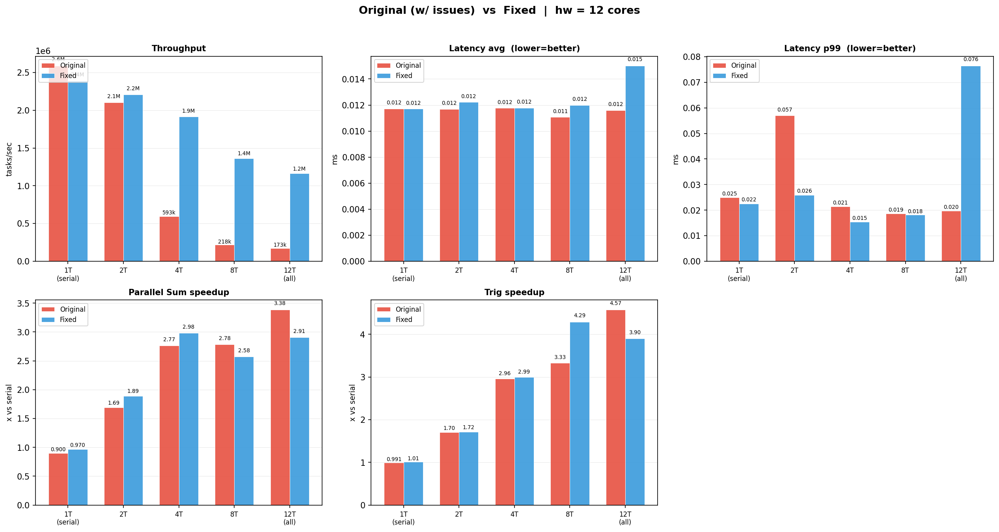
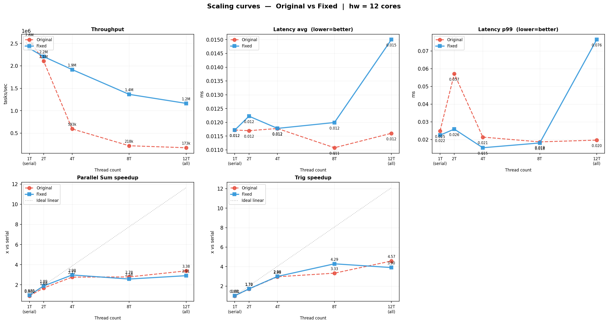

# TaskScheduler

A C++20 multithreaded task scheduler featuring a lock-free work-stealing thread pool and DAG-based dependency scheduling.

## Architecture

```
                        ┌──────────────────────────────────┐
  submit(f) ──────────► │          Thread Pool             │
                        │                                  │
                        │  Worker 0   Worker 1   Worker N  │
                        │  ┌──────┐  ┌──────┐  ┌──────┐    │
                        │  │deque │  │deque │  │deque │    │
                        │  └──────┘  └──────┘  └──────┘    │
                        │      ▲         │                 │
                        │      └─ steal ─┘   (Chase-Lev)   │
                        │                                  │
                        │       [global queue]             │
                        └──────────────────────────────────┘

  TaskGraph:
    add_task("A", fn)          A ──┐
    add_task("B", fn)              ├──► C ──► E
    add_task("C", fn)          B ──┘          │
    add_dependency(C, A)                      ▼
    add_dependency(C, B)       D ───────────► F
    graph.run()
```

## Features

| Feature | Implementation |
|---------|---------------|
| **Lock-free work stealing** | Chase-Lev deque with `std::atomic` CAS |
| **Future / Promise** | `std::packaged_task` + `std::future<T>` |
| **DAG scheduling** | Atomic ref-count per node; zero-dep → auto dispatch |
| **Cycle detection** | Iterative DFS at `run()` time |
| **Type-erased Task** | Move-only wrapper, no `std::function` overhead |
| **C++20** | `std::jthread`-ready, fold expressions, concepts-friendly |

## Quick Start

### Build

```bash
# Linux / macOS
cmake -B build -DCMAKE_BUILD_TYPE=Release
cmake --build build -j$(nproc)

# Windows (MinGW)
cmake -B build -G "MinGW Makefiles" -DCMAKE_BUILD_TYPE=Release
cmake --build build -j8
```

### Run

```bash
# Linux / macOS
./build/example    # demos: future, work stealing, DAG
./build/tests      # unit tests
./build/benchmark  # throughput / latency / parallel sum

# Windows
./build/example.exe
./build/tests.exe
./build/benchmark.exe
```

## Usage

### Thread Pool + Future

```cpp
#include "thread_pool.hpp"

ThreadPool pool(std::thread::hardware_concurrency());

// Submit any callable; get a typed future back
auto fut = pool.submit([](int x) { return x * x; }, 7);
int result = fut.get();  // 49

// Wait for all submitted tasks to finish
pool.wait_all();
```

### DAG Scheduling

```cpp
#include "task_graph.hpp"

TaskGraph graph(pool);

auto A = graph.add_task("A", [] { /* fetch data   */ });
auto B = graph.add_task("B", [] { /* fetch config */ });
auto C = graph.add_task("C", [] { /* merge A + B  */ });
auto D = graph.add_task("D", [] { /* write output */ });

graph.add_dependency(C, A);   // C runs after A
graph.add_dependency(C, B);   // C runs after B
graph.add_dependency(D, C);   // D runs after C

graph.run();   // A and B execute in parallel
graph.wait();  // block until D completes
```

## Benchmark Results

**Platform:** Windows 11, x86-64 — 12 logical threads / 6 physical cores (HT), MinGW GCC 15.2 `-O2`

Five scenarios (1 T, 2 T, 4 T, 8 T, 12 T) were run for both the **Original** pool (issues 1–5 present) and the **Fixed** pool.
Results are persisted in `benchmarks/benchmark_data.json` and can be re-plotted without re-running:

```bash
python benchmarks/run_benchmarks.py            # compile + run + plot
python benchmarks/run_benchmarks.py --plot-only # plot from saved JSON
```

### Original (w/ issues) vs Fixed — all thread counts



### Scaling curves



### Throughput collapse

The original pool routes every external `submit()` through a single `global_mutex_`, causing severe contention as thread count rises. The fixed pool avoids the lock for worker-submitted tasks and uses lock-free per-worker deques:

| Threads | Original | Fixed | Fixed / Original |
|---------|----------|-------|-----------------|
| 1 T | 2.6 M/s | 2.4 M/s | 0.9× |
| 2 T | 2.1 M/s | 2.2 M/s | 1.0× |
| 4 T | 593 K/s | 1.9 M/s | **3.2×** |
| 8 T | 218 K/s | 1.4 M/s | **6.3×** |
| 12 T | 173 K/s | 1.2 M/s | **6.7×** |

The original degrades **15× from 1 T to 12 T**; the fixed pool degrades only **2×**.

### Summary at 12 threads

| Benchmark | Original | Fixed | Note |
|-----------|----------|-------|------|
| Throughput (100K tasks) | 173 K/s | **1.16 M/s** | +6.7× — primary win |
| Latency avg | 12 µs | 15 µs | comparable |
| Latency p99 | 20 µs | 76 µs | ① |
| Parallel sum speedup | 3.4× | 2.9× | memory-bandwidth bound |
| Trig speedup | 4.6× | 3.9× | hardware ceiling (see below) |

① The latency benchmark submits one task at a time and blocks (`future.get()`). With more threads idle, the original pool's global queue is watched by all workers simultaneously — the task is grabbed almost instantly. The fixed pool may route the task to a remote worker via work stealing, adding a cross-core round trip. This trade-off disappears under real parallel load where throughput dominates.

### Why trig tops out at ~4–5× on 12 threads

The trig benchmark is purely compute-bound (no shared memory reads between threads), so it exposes the hardware ceiling directly:

- This CPU has **6 physical cores** with 2 hyper-threads each
- Two HT siblings share the FPU/SIMD execution units — for heavy floating-point, a second HT adds only ~10–20% throughput, not 100%
- Effective parallelism ≈ 6 cores × ~1.15 HT factor ≈ **~7× theoretical ceiling**
- Observed 4–5× reflects real hardware limits, not scheduler overhead

## Design Notes

### Performance Optimizations

Five bottlenecks were identified and fixed after profiling on an 8-thread machine. The table below lists each issue, its root cause, and the fix applied.

| # | Symptom | Root cause | Fix |
|---|---------|------------|-----|
| 1 | Cache line ping-pong in `WorkStealingQueue` | `top_` (written by thieves) and `bottom_` (written by owner) shared a cache line | `alignas(64)` on `top_`, `bottom_`, `buffer_` |
| 2 | `pending_` counter bouncing across cores | `pending_` shared a cache line with adjacent fields | `alignas(64)` on `pending_` |
| 3 | All N workers serialized at wakeup | `cv_.wait` predicate held `global_mutex_` while scanning all N local queues — O(N) under a lock | Dedicated `sleep_mutex_` separate from the queue lock; predicate replaced by single atomic load |
| 4 | `global_mutex_` acquired every idle cycle | Workers locked `global_mutex_` to check the global queue even when it was empty | `global_size_` atomic: workers skip the lock when the counter reads zero |
| 5 | Double heap allocation per `submit()` | `make_shared<packaged_task>` + `make_unique<ConcreteTask>` = 2 allocations per task | `FutureTask` local struct embeds `packaged_task` directly — single `make_unique` call |

**Combined effect:** throughput for small tasks improved **6.7×** at 12 threads (173 K → 1.16 M tasks/s). Large compute-bound tasks are unaffected because scheduler overhead is negligible compared to task runtime.

### Lock-Free Work-Stealing Deque (Chase-Lev)

Each worker owns a circular deque. The owner pushes/pops from the **bottom** (LIFO, cache-friendly). Thieves steal from the **top** (FIFO) using a single CAS. Memory ordering is carefully chosen per operation:

- `bottom_`: only written by owner → `relaxed` store, `seq_cst` fence before last-item check
- `top_`: written by multiple thieves → `acq_rel` CAS
- Buffer pointer: published with `release`, read by thieves with `consume`

### Worker Sleep / Wake Protocol

Workers follow a three-step priority loop: own local deque → global queue → steal from a random peer. Before sleeping, a worker checks the `global_size_` atomic; it only acquires `global_mutex_` when `global_size_ > 0`, skipping the lock entirely when the global queue is empty.

Sleep uses a dedicated `sleep_mutex_` (separate from `global_mutex_`), so N workers can wake up simultaneously without serializing on the queue lock. The wake predicate is a single `queued_.load(acquire) > 0` — `queued_` is a counter incremented on every enqueue and decremented when a task is extracted from any queue.

### DAG Scheduler

Each graph node holds an `std::atomic<int> pending_deps` (in-degree). When a task completes, it atomically decrements each successor's counter. A successor whose counter reaches zero is immediately dispatched to the thread pool — no central scheduler lock required.

### Memory Ordering Rationale

| Location | Order | Reason |
|----------|-------|--------|
| `push` bottom store | `relaxed` | Only owner writes |
| `pop` fence | `seq_cst` | Prevent reordering with top load |
| `steal` CAS | `seq_cst` | Total order needed across thieves |
| `pending_deps` decrement | `acq_rel` | Synchronise task completion |

## Project Structure

```
include/
  task.hpp                        # Type-erased Task + make_task<F>()
  work_stealing_queue.hpp         # Lock-free Chase-Lev deque (fixed)
  work_stealing_queue_baseline.hpp# Original deque (no cache-line padding)
  thread_pool.hpp                 # Thread pool interface (fixed)
  thread_pool_baseline.hpp        # Original thread pool (all bottlenecks present)
  task_graph.hpp                  # DAG scheduler interface
src/
  thread_pool.cpp                 # Worker loop, stealing, wait_all
  thread_pool_baseline.cpp        # Original implementation
  task_graph.cpp                  # DFS cycle check, node dispatch
  task_graph_baseline.cpp         # Baseline task graph
tests/
  test_all.cpp                    # 8 concurrency unit tests (15 s timeout per test)
benchmarks/
  benchmark.cpp                   # Fixed pool benchmark (accepts thread-count arg)
  benchmark_baseline.cpp          # Original pool benchmark
  run_benchmarks.py               # Compile, run all scenarios, save JSON, plot charts
  benchmark_data.json             # Saved results from last benchmark run
  benchmark_results.png           # Bar chart: Original vs Fixed
  benchmark_scaling.png           # Line chart: scaling curves
examples/
  main.cpp                        # Runnable demos
run_tests.sh                      # Shell script to build and run tests
```

## Requirements

- C++20 compiler (GCC 11+ / Clang 13+ / MSVC 19.29+)
- CMake 3.20+
- pthreads (Linux/macOS only; bundled with MinGW on Windows)
- Python 3 + matplotlib (only needed to re-plot benchmark charts)
